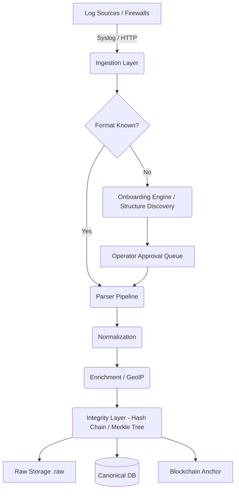

# Universal Log Pre-Processing Framework (ULPF) 

## 1. Executive Summary

The **Universal Log Pre-Processing Framework (ULPF)** is a vendor-neutral log processing pipeline designed to ingest, normalize, and secure audit trails at scale. By dynamically identifying log formats, normalizing them into a canonical schema, and sealing them with cryptographic proofs, ULPF guarantees the provable integrity of cybersecurity telemetry from generation to analysis.

---

## 2. High-Level Design (HLD)

The HLD defines the overarching system architecture, separating the framework into discrete sub-systems. ULPF follows a modular, pipelined architecture tailored for high-throughput stream processing.

### 2.1 Core Architectural Components

1.  **Ingestion Layer**
    *   **REST API Receiver:** FastAPI-driven HTTP endpoints for batch and single-event log ingestion.
    *   **UDP Native Syslog Receiver:** A background, asynchronous UDP listener (port 5514) handling raw network device logs in real-time.
2.  **Detection & Onboarding Layer**
    *   **Auto-Detection:** Identifies standard formats (CEF, Syslog, JSON).
    *   **Dynamic Onboarding Mechanism:** A self-learning structural inference engine that extracts key-value patterns from unknown logs, allowing human operators to approve new vendor schemas via a centralized queue.
3.  **Parser & Normalization Pipeline**
    *   **Abstract Parsers:** Purpose-built parsers for different structural families (Regex-driven Syslog, delimiter-based CEF, nested JSON).
    *   **Canonical Mapping:** Translates vendor-specific fields (e.g., `src_ip`, `SourceAddress`, `srcIp`) into a unified canonical schema (e.g., `source_ip`).
4.  **Enrichment & Context Layer**
    *   **GeoIP Enrichment:** Augments normalized logs with geographical intelligence based on IP addresses.
    *   **Trust Scoring Integration:** Annotates records with computed risk/trust metrics.
5.  **Integrity & Tamper-Evidence Layer**
    *   **Cryptographic Fingerprinting:** SHA-256 hashes of the raw payloads immediately upon ingestion to anchor origin truth.
    *   **Hash Chaining:** Each log event cryptographically references the previous event's hash, creating an unbroken chain (similar to a blockchain).
    *   **Merkle Tree Batching:** Batches event hashes into Merkle Trees, generating a root hash for efficient auditing.
6.  **Observability & Dashboard**
    *   **Live Viewer UI:** Zero-reload dashboard built for real-time visualization of ingestion streams.
    *   **Playground:** An interactive testbed for simulating the pipeline on arbitrary logs.
7.  **Storage Layer (MVP / Production Analogues)**
    *   **Raw Storage Store:** Immutable storage of pristine `.raw` logs (Filesystem -> *Prod: Amazon S3/MinIO*).
    *   **Relational Storage:** Stores parsed canonical logs (SQLite -> *Prod: PostgreSQL/Elasticsearch*).
    *   **Blockchain Anchor Log:** Ledger of Merkle roots (Local Mock -> *Prod: Hyperledger Fabric*).

### 2.2 System Data Flow

---

## 3. Low-Level Design (LLD)

The LLD breaks down individual internal abstractions, data schemas, and precise module responsibilities.

### 3.1 Data Schemas & Models

**1. Canonical Log Model (`CanonicalLogEvent`)**
*   `event_id`: UUID
*   `timestamp`: ISO8601 UTC
*   `vendor`: String (e.g., "PaloAlto", "Cisco")
*   `product`: String
*   `source_ip`: IP Address String
*   `destination_ip`: IP Address String
*   `action`: String (e.g., "ALLOW", "DENY")
*   `raw_hash`: SHA-256 string connecting to the exact immutable proof.
*   `chain_hash`: Cryptographic link to previous event.
*   `is_tampered`: Boolean (calculated at read-time).

**2. Cryptographic Proof (Merkle Batch)**
*   `batch_id`: UUID
*   `start_time` / `end_time`: Timestamps defining the batch epoch.
*   `event_count`: Integer
*   `merkle_root`: The apex SHA-256 hash.

### 3.2 Modular Pipelines and Class Interactions

*   **`ingestion.router` / `ingestion.udp_server`:** Both interfaces coalesce onto a central processing queue. The UDP Server operates purely asynchronously via `asyncio.DatagramProtocol`.
*   **`detection.format_detector`:** Executes Regex and heuristics. Falls back to generating a `learning_candidate` if parsing fails.
*   **`onboarding.models`:** Defines states (`PENDING`, `APPROVED`, `REJECTED`). New parsers are generated programmatically upon operator approval.
*   **`normalization.field_mapper`:** Uses a declarative dictionary config mapping known telemetry fields to the target canonical model.
*   **`integrity.hash_chain` / `integrity.merkle_tree`:**
    *   Creates temporal dependencies (`hash(n) = SHA256(hash(n-1) + data(n))`).
    *   Once a configured batch size is reached (or timeout), `merkle_tree.py` builds the binary tree of hashes and writes the Merkle Root out to the Anchoring service.

### 3.3 Verification Logic / Audit (`/verify` endpoint)

When a validation request is initiated:
1.  Read the normalized log from the Database.
2.  Retrieve the linked `.raw` payload from the Filesystem Object Store.
3.  Re-calculate the SHA-256 hash of the `.raw` payload in memory.
4.  Compare the memory hash against the `raw_hash` locked in the Database.
5.  If mismatch occurs, flag the record as `TAMPERED`.
6.  (Optional extended mode) Follow the hash chain backward to ensure no events were dropped or reordered.

### 3.4 Key API Endpoints

| Endpoint | Method | Responsibility |
| :--- | :--- | :--- |
| `/api/logs/ingest` | `POST` | Synchronously ingest REST-delivered events. |
| `/api/verify/{event_id}`| `GET` | Triggers a mathematical audit of an event against its raw evidence. |
| `/api/onboarding/pending` | `GET` | Retrieves unknown logs awaiting human review and mapping. |
| `/api/onboarding/{id}/approve` | `POST` | Persists a dynamically generated parser to memory and DB. |
| `/dashboard` | `GET` | Render the HTML UI connecting to WebSocket/SSE streams. |

### 3.5 Security & Exception Handling

*   **Dead Letter Queue (DLQ):** Un-parseable and malformed logs immediately route to the DLQ, ensuring pipeline throughput remains unaffected while saving evidence of the payload for post-mortem debugging.
*   **Air-Gapped Deployment:** Containerized via `Dockerfile` and `docker-compose.yml`, minimizing dependencies and standardizing the runtime environment for highly-secure operation centers (SOC).
*   **Idempotency:** Re-processing the same `.raw` file will yield the exact same deterministic hashes.

---

