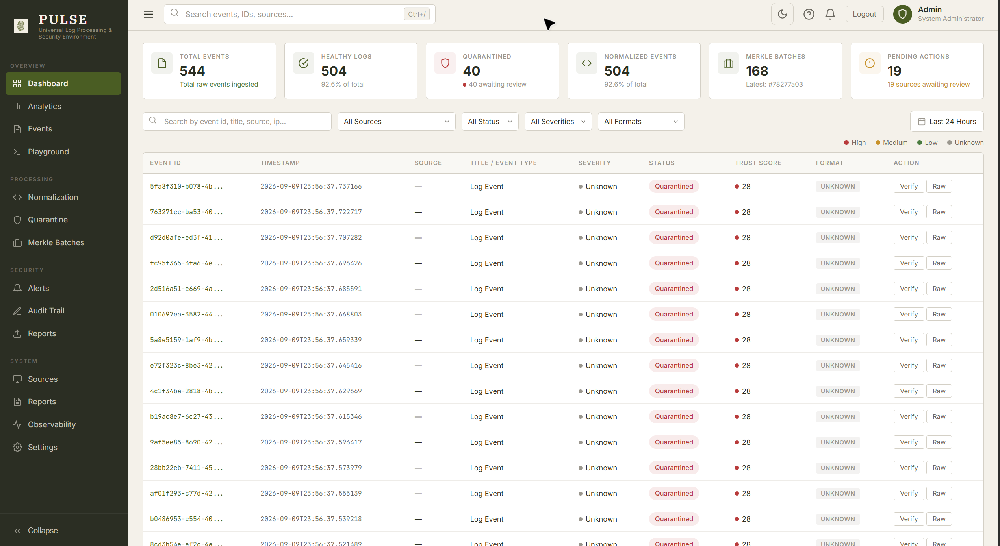
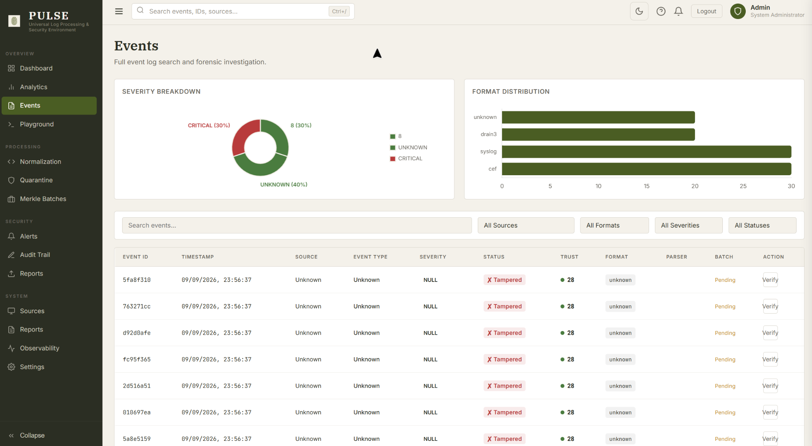
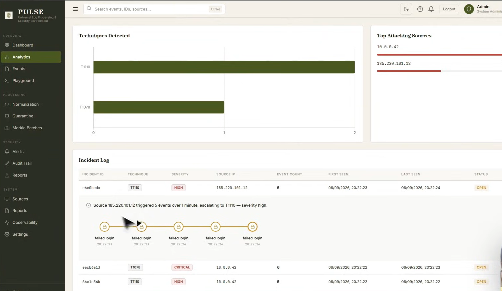
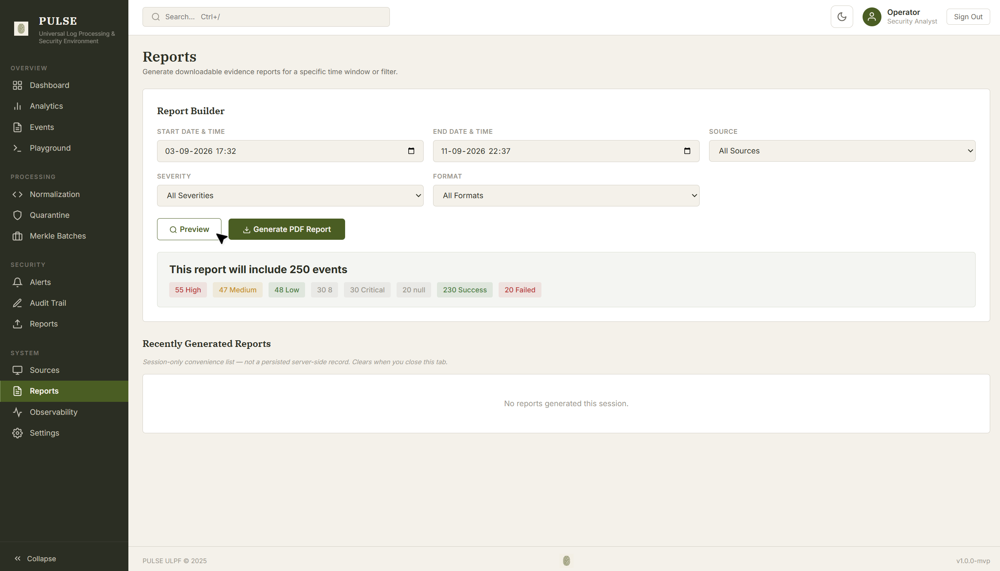
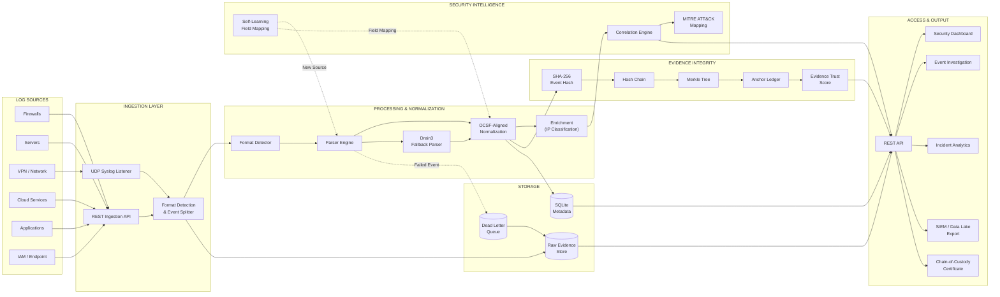

# PULSE — Universal Log Pre-Processing Framework (ULPF)

> **A security-focused framework for universal log ingestion, normalization, evidence integrity, and security-event correlation.**

**PS ID:** 26156
**PS Title:** Universal Log Pre-processing Framework (ULPF)
**Category:** Software
**Theme:** Cybersecurity & Blockchain

---

## 1. Project Information

### Overview

**PULSE** is a universal log pre-processing framework designed to ingest heterogeneous security logs from enterprise infrastructure, automatically detect and parse their formats, normalize them into a unified OCSF-aligned schema, preserve the original evidence, and make the resulting events ready for SIEM, data lake, analytics, and security investigation workflows.

The framework follows a modular processing architecture in which ingestion, detection, parsing, normalization, enrichment, integrity verification, correlation, storage, and export are handled as distinct stages.

### Core Capabilities

| Capability                   | Description                                                      |
| ---------------------------- | ---------------------------------------------------------------- |
| **Universal Ingestion**      | Accept logs through REST APIs and UDP Syslog                     |
| **Format Detection**         | Automatically identify supported log formats                     |
| **Event Splitting**          | Handle JSON arrays, NDJSON, and multi-line Syslog input          |
| **Parsing**                  | Parse JSON, Syslog, CEF, LEEF, and unstructured logs             |
| **Normalization**            | Convert events into a unified OCSF-aligned representation        |
| **Evidence Integrity**       | Preserve raw events and provide cryptographic verification       |
| **Self-Learning Onboarding** | Suggest field mappings for previously unseen sources             |
| **Security Correlation**     | Correlate related events and map them to MITRE ATT&CK            |
| **Export**                   | Export normalized events to CSV, JSON, and CEF                   |
| **Investigation**            | Provide dashboards, event details, analytics, and incident views |

---

## 2. Problem Statement

Modern enterprises generate massive volumes of security telemetry from firewalls, servers, VPNs, cloud platforms, applications, databases, identity systems, and endpoint infrastructure.

However, these systems produce logs in highly heterogeneous formats, including:

* Syslog
* JSON
* CEF
* LEEF
* CSV
* Vendor-specific schemas
* Unstructured application logs

This fragmentation creates several challenges for security teams:

* Source-specific parsers must be manually developed and maintained.
* Adding a new vendor or log source increases engineering effort.
* Different schemas make cross-source analysis difficult.
* Unrecognized or malformed events can fail during preprocessing.
* Original event data may be lost or modified during transformation.
* SIEM, data lake, and machine-learning systems require additional normalization before consuming the data.

### Core Challenge

> **How can heterogeneous security logs be automatically transformed into a unified, analysis-ready representation while preserving the original evidence and its forensic integrity?**

---

## 3. Proposed Solution

PULSE addresses this problem through a modular, API-driven preprocessing architecture.

The framework accepts heterogeneous security events and processes them through a sequence of detection, parsing, normalization, enrichment, integrity, and correlation stages.

### Processing Flow

```text
Heterogeneous Security Logs
            │
            ▼
┌──────────────────────────┐
│    Ingestion Gateway     │
│ REST API + UDP Syslog    │
└────────────┬─────────────┘
             ▼
┌──────────────────────────┐
│ Format Detection &       │
│ Event Splitting          │
└────────────┬─────────────┘
             ▼
┌──────────────────────────┐
│      Parser Engine       │
│ JSON / Syslog / CEF /    │
│ LEEF / Drain3            │
└────────────┬─────────────┘
             ▼
┌──────────────────────────┐
│ OCSF-Aligned             │
│ Normalization Engine     │
└────────────┬─────────────┘
             │
       ┌─────┴─────┐
       ▼           ▼
┌────────────┐ ┌────────────────┐
│ Integrity  │ │    Security    │
│   Layer    │ │  Intelligence  │
└────────────┘ └────────────────┘
       │           │
       └─────┬─────┘
             ▼
┌──────────────────────────┐
│ Storage & REST API       │
└────────────┬─────────────┘
             ▼
┌──────────────────────────┐
│ Dashboard / SIEM /       │
│ Data Lake / Investigation│
└──────────────────────────┘
```

### Key Design Principles

**Normalize once, consume everywhere**

A unified event representation allows downstream systems to consume logs without implementing source-specific processing.

**Preserve original evidence**

Raw event data is retained so that normalization does not destroy the original forensic context.

**Verify evidence integrity**

Cryptographic hashing and chained verification make unauthorized modification detectable.

**Modular processing**

Individual processing stages can be extended without redesigning the complete system.

**Adaptive onboarding**

Previously unseen log sources can receive confidence-scored field-mapping suggestions.

**Integration-ready**

Normalized events can be exported to SIEM and data lake environments.

---

## 4. Key Features

### Universal Log Ingestion

* JSON
* Syslog
* CEF
* LEEF
* Unstructured logs through Drain3 fallback
* REST-based ingestion
* Native UDP Syslog listener

### Intelligent Format Handling

* Automatic format detection
* JSON array processing
* NDJSON processing
* Multi-line Syslog splitting
* Multiple events per request

### Unified Normalization

Events are transformed into a common OCSF-aligned schema, providing a consistent structure for downstream analytics and security systems.

### Cryptographic Evidence Integrity

Each event can be protected using the following integrity pipeline:

```text
Event
  │
  ▼
SHA-256 Hash
  │
  ▼
Hash Chain
  │
  ▼
Merkle Tree
  │
  ▼
Anchor Ledger
  │
  ▼
Verification
```

This provides a tamper-evident integrity mechanism for stored security evidence.

### Evidence Trust Score

PULSE computes an **Evidence Trust Score** for each event using a documented weighted formula based on the integrity properties of the event.

### Self-Learning Source Onboarding

When an unknown vendor source is encountered, PULSE can suggest field mappings with associated confidence scores rather than requiring an entirely new parser to be manually implemented.

### Security Event Correlation

Related events can be correlated into incidents and mapped to relevant MITRE ATT&CK techniques, allowing analysts to move from individual events toward higher-level security activity.

### Dead Letter Queue

Events that cannot be successfully parsed are routed to a **Dead Letter Queue** while preserving their original raw representation.

### SIEM / Data Lake Export

Normalized events can be exported in:

* CSV
* JSON
* CEF

### Chain-of-Custody Certificate

PULSE can generate a verifiable certificate representing the integrity state of collected evidence.

### Authentication

API access is protected using JWT-based authentication with bcrypt password hashing.

### Security Dashboard

The web interface provides:

* System dashboard
* Event investigation
* Event detail view
* Evidence Trust Score
* Incident analytics
* Attack correlation
* Source onboarding
* Interactive log playground

### Deployment

The complete application is containerized using Docker and Docker Compose, making it suitable for isolated and air-gapped environments.

---

## Screenshots

### Dashboard



### Event Detail & Trust Score



### Attack Correlation



### Report analysis



---

## 5. Technology Stack

| Layer                    | Technologies                      |
| ------------------------ | --------------------------------- |
| **Frontend**             | HTML, CSS, JavaScript, Chart.js   |
| **Backend**              | Python, FastAPI, Uvicorn          |
| **API Validation**       | Pydantic                          |
| **ORM / Database Layer** | SQLAlchemy                        |
| **Log Parsing**          | Custom Format Detector, Drain3    |
| **Normalization**        | OCSF-aligned unified schema       |
| **Security**             | JWT, bcrypt                       |
| **Integrity**            | SHA-256, Hash Chain, Merkle Trees |
| **Database**             | SQLite (MVP)                      |
| **Raw Evidence Storage** | Local Filesystem                  |
| **Integrity Anchor**     | Append-only Ledger                |
| **Testing**              | Pytest                            |
| **Deployment**           | Docker, Docker Compose            |

### Technology Rationale

**FastAPI** provides the API layer for ingestion and system access.

**Drain3** provides template mining capabilities for previously unseen and unstructured log formats.

**SQLAlchemy** provides database abstraction and supports a future migration toward PostgreSQL.

**SHA-256, Hash Chains, and Merkle Trees** provide cryptographic mechanisms for detecting modification of stored evidence.

**Docker and Docker Compose** provide consistent deployment across development, testing, and isolated environments.

---

## 6. Architecture

PULSE follows a modular layered architecture in which raw security telemetry passes through independent processing stages before becoming normalized, integrity-verified, correlated, searchable, and exportable.

### System Architecture



### Architecture Layers

| Layer                    | Responsibility                                       |
| ------------------------ | ---------------------------------------------------- |
| **Log Sources**          | Generate heterogeneous security events               |
| **Ingestion Layer**      | Receive events through REST and UDP Syslog           |
| **Detection Layer**      | Identify formats and separate individual events      |
| **Parser Engine**        | Convert source-specific data into structured events  |
| **Normalization Engine** | Produce a unified OCSF-aligned representation        |
| **Enrichment Layer**     | Add contextual information to normalized events      |
| **Onboarding Layer**     | Suggest mappings for previously unseen sources       |
| **Correlation Engine**   | Identify relationships between events                |
| **MITRE Mapping**        | Associate correlated activity with ATT&CK techniques |
| **Integrity Layer**      | Hash, chain, batch, and verify evidence              |
| **Storage Layer**        | Store metadata, raw evidence, and failed events      |
| **API Layer**            | Provide authenticated access to system capabilities  |
| **Presentation Layer**   | Provide dashboards and investigation interfaces      |
| **Export Layer**         | Deliver normalized data to external systems          |

### End-to-End Data Flow

```text
                 ┌──────────────────────┐
                 │   SECURITY SOURCES   │
                 │ Firewall • Server    │
                 │ VPN • Cloud • Apps   │
                 └──────────┬───────────┘
                            │
                            ▼
                 ┌──────────────────────┐
                 │   INGESTION GATEWAY  │
                 │ REST API / UDP       │
                 │ Syslog Listener      │
                 └──────────┬───────────┘
                            │
                            ▼
                 ┌──────────────────────┐
                 │ FORMAT DETECTION &   │
                 │ EVENT SPLITTING      │
                 └──────────┬───────────┘
                            │
                            ▼
                 ┌──────────────────────┐
                 │    PARSER ENGINE     │
                 │ JSON / Syslog / CEF  │
                 │ LEEF / Drain3       │
                 └──────────┬───────────┘
                            │
                            ▼
                 ┌──────────────────────┐
                 │ NORMALIZATION ENGINE │
                 │    OCSF-ALIGNED      │
                 └──────────┬───────────┘
                            │
              ┌─────────────┼─────────────┐
              │             │             │
              ▼             ▼             ▼
        ┌──────────┐  ┌────────────┐  ┌────────────┐
        │ ENRICH   │  │ INTEGRITY  │  │ CORRELATION│
        │          │  │            │  │            │
        └────┬─────┘  └─────┬──────┘  └──────┬─────┘
             │              │                │
             │              ▼                ▼
             │        ┌────────────┐   ┌────────────┐
             │        │ SHA-256 →  │   │   MITRE     │
             │        │ Chain →    │   │ ATT&CK      │
             │        │ Merkle     │   │ Mapping     │
             │        └────────────┘   └────────────┘
             │
             └──────────────┬─────────────────┘
                            ▼
                 ┌──────────────────────┐
                 │       STORAGE        │
                 │ Metadata + Raw       │
                 │ Evidence + DLQ       │
                 └──────────┬───────────┘
                            │
                            ▼
                 ┌──────────────────────┐
                 │      REST API        │
                 └──────────┬───────────┘
                            │
              ┌─────────────┼─────────────┐
              ▼             ▼             ▼
        ┌──────────┐  ┌────────────┐  ┌──────────┐
        │Dashboard │  │Investigation│ │  Export  │
        │Analytics │  │  Console    │ │SIEM/Data │
        └──────────┘  └────────────┘  │   Lake   │
                                      └──────────┘
```

---

## 7. Repository Structure

```text
PULSE-ULPF/
│
├── README.md
├── main.py
├── SUBMISSION_GUIDE.md
│
├── submission/
│   ├── PRESENTATION.md
│   └── DEMO.md
│
├── api/                    # REST API and authentication
├── ingestion/              # REST + UDP Syslog ingestion
├── detection/              # Format detection and event splitting
├── parser/                 # Log parsers and Drain3 fallback
├── normalization/          # OCSF-aligned normalization
├── enrichment/             # Event enrichment
├── integrity/              # Hashing, hash chains, Merkle trees
├── onboarding/             # Unknown-source field mapping
├── correlation/            # Event correlation and MITRE mapping
│
├── static/                 # Frontend dashboard and UI
├── tests/                  # Automated tests
│
├── docs/
│   └── architecture.md     # Detailed architecture documentation
│
├── assets/
│   └── screenshots/        # Project screenshots
│
├── requirements.txt
├── Dockerfile
├── docker-compose.yml
├── .gitignore
└── LICENSE
```

### What Goes Where?

| Item                           | Location                                                                                                                               |
| ------------------------------ | -------------------------------------------------------------------------------------------------------------------------------------- |
| **Source Code**                | `api/`, `ingestion/`, `detection/`, `parser/`, `normalization/`, `enrichment/`, `integrity/`, `onboarding/`, `correlation/`, `static/` |
| **Main Application**           | `main.py`                                                                                                                              |
| **Architecture Documentation** | `docs/`                                                                                                                                |
| **Automated Tests**            | `tests/`                                                                                                                               |
| **Project Screenshots**        | `assets/screenshots/`                                                                                                                  |
| **Final Presentation**         | `submission/`                                                                                                                          |
| **Demo Video Information**     | `submission/DEMO.md`                                                                                                                   |
| **Project Overview**           | `README.md`                                                                                                                            |

---

## 8. Final Presentation

The final project presentation is available in:

```text
submission/PRESENTATION.md
```

---

## 9. Demo Video

The project demonstration information is available in:

```text
submission/DEMO.md
```

---

## 10. Screenshots / Prototype Photos

Project screenshots and prototype visuals are available in:

```text
assets/screenshots/
```

### Dashboard


### Event Investigation & Evidence Trust Score


### Attack Correlation


### Report Generation


---

## 11. Installation

### Option 1 — Local Installation

Clone the repository:

```bash
git clone https://github.com/atul-dev26/PULSE.git PULSE-ULPF
cd PULSE-ULPF
```

Install the required dependencies:

```bash
pip install -r requirements.txt
```

### Option 2 — Docker Deployment

Docker Compose is the recommended deployment method:

```bash
docker-compose up --build
```

---

## 12. Run

### Local Development

Start the FastAPI application:

```bash
python -m uvicorn main:app --reload
```

The following interfaces will then be available:

| Interface             | Address                           |
| --------------------- | --------------------------------- |
| **Dashboard**         | `http://127.0.0.1:8000/dashboard` |
| **API Documentation** | `http://127.0.0.1:8000/docs`      |

If anyone want to login in the deployed application:
url : 'https://pulse-ulpf.up.railway.app/login'
username: admin
password: changeme123

### Default Credentials

```text
Username: admin
Password: changeme123
```

---

## 13. Future Scope

PULSE is designed as an extensible MVP architecture. The following improvements can extend the system toward production-scale deployment.

### Scalable Storage

* Migrate metadata storage from SQLite to PostgreSQL.
* Move raw evidence storage to MinIO or S3-compatible object storage.
* Introduce scalable indexing for large event volumes.

### Permissioned Blockchain Integration

Replace the local append-only anchor ledger with a permissioned blockchain network such as Hyperledger Fabric for distributed evidence anchoring and verification.

### High-Throughput Streaming

Introduce Apache Kafka for distributed and horizontally scalable event ingestion capable of handling significantly larger event volumes.

### Search & Analytics

Integrate OpenSearch / Elasticsearch for:

* Full-text event search
* Large-scale analytics
* Advanced filtering
* Security investigation
* Historical event analysis

### Advanced Detection

Expand the rule-based correlation engine with:

* Supervised ML models
* Anomaly detection
* Behavioral analytics
* Automated incident prioritization
* Threat-intelligence enrichment

### Enterprise Authentication

Integrate with organizational SSO and IAM systems to provide:

* Enterprise authentication
* Fine-grained RBAC
* Centralized identity management
* Audit logging

### Full OCSF Compliance

The current implementation provides an **OCSF-aligned normalized schema**.

Future development can introduce complete OCSF JSON Schema validation and broader coverage of OCSF event classes.

---

# PULSE at a Glance

```text
┌──────────────────────────────────────────────────────────────┐
│                           PULSE                              │
│       Universal Log Pre-Processing Framework (ULPF)          │
├──────────────────────────────────────────────────────────────┤
│                                                              │
│   INGEST        →        DETECT        →        PARSE         │
│                                                              │
│   NORMALIZE     →        ENRICH        →        CORRELATE     │
│                                                              │
│   PRESERVE      →        HASH          →        VERIFY        │
│                                                              │
│   STORE         →        INVESTIGATE   →        EXPORT        │
│                                                              │
├──────────────────────────────────────────────────────────────┤
│                                                              │
│ Universal Logs • Evidence Integrity • Security Intelligence │
│ MITRE ATT&CK • SIEM Integration • Forensic Readiness        │
│                                                              │
└──────────────────────────────────────────────────────────────┘
```

---

## License

This project is developed as part of the **Universal Log Pre-processing Framework (ULPF)** problem statement and is provided under the license specified in the repository.
